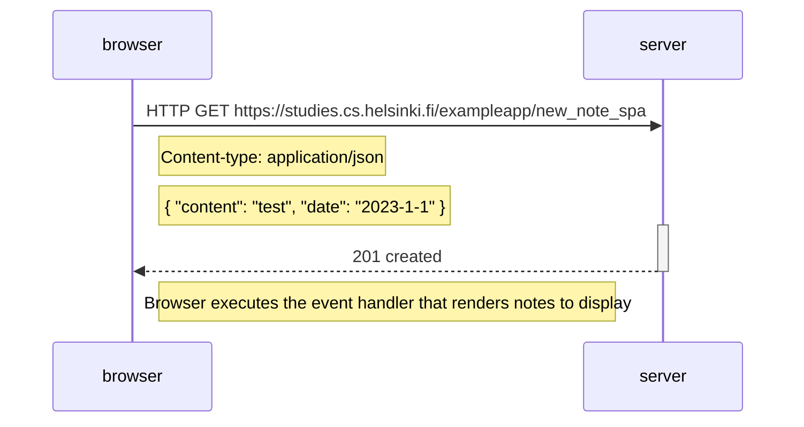

```mermaid
sequenceDiagram
    participant browser
    participant server


    browser->>server: HTTP GET https://studies.cs.helsinki.fi/exampleapp/new_note_spa
    Note right of browser:Content-type: application/json
    Note right of browser:{ "content": "test", "date": "2023-1-1" }
    activate server
    server-->>browser: 201 created
    deactivate server

    Note right of browser: Browser executes the event handler that renders notes to display
```